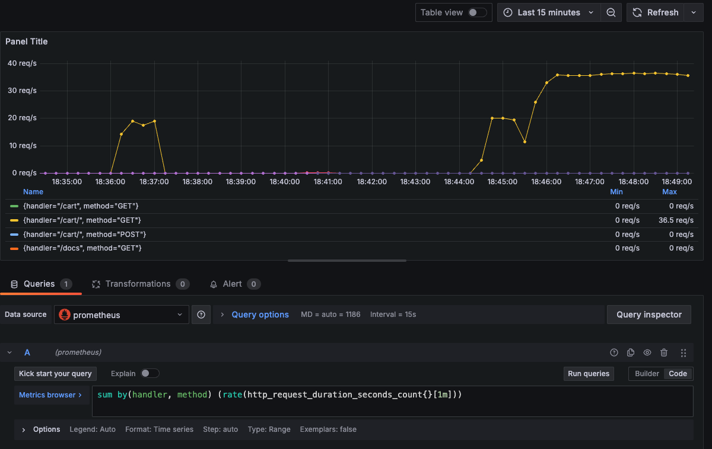
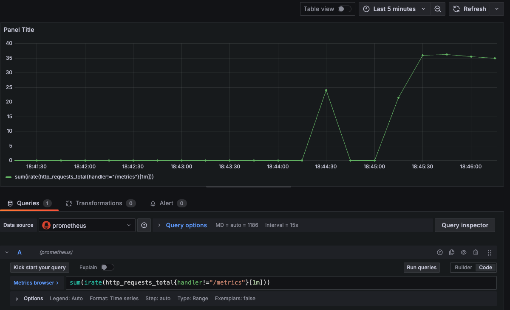
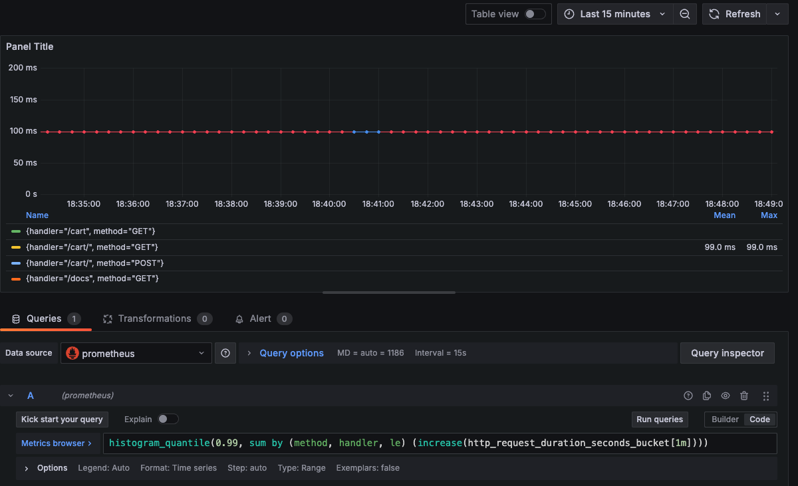

# ДЗ 3 (решение)
Интегрированы Docker c Prometheus и Grafana в ДЗ 2
- [Dockerfile](../../lecture_2/hw/Dockerfile)
- [docker-compose.yml](../../lecture_2/hw/docker-compose.yml)
- [prometheus.yml](../../lecture_2/hw/settings/prometheus.yml)

Для запуска используется команда 
```
docker-compose up --build local grafana prometheus
```

Cкрины дашбордами в Grafana (логин пароль от графаны: admin)


